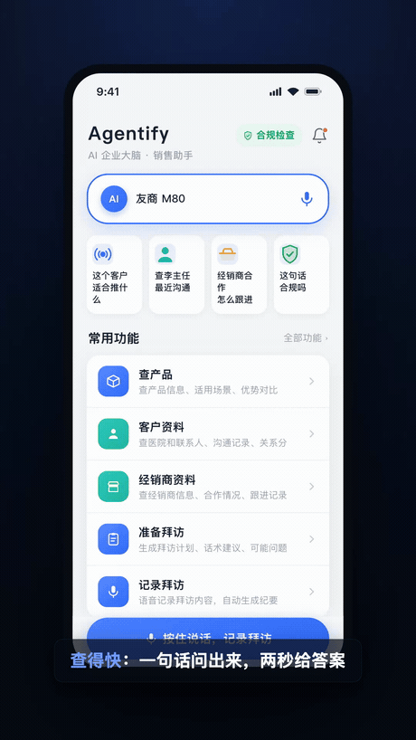

<h1 align="center">awesome-ceo-stack</h1>

<p align="center"><b>English</b> · <a href="README.zh-CN.md">简体中文</a></p>

<p align="center">
  <b>A curated stack of Claude / OpenClaw agent skills for founders &amp; CEOs.</b><br>
  Ship a product promo video, stand up an enterprise knowledge base, generate investor-grade decks,
  and run your operating cadence — from your terminal, with Claude Code, Codex, or OpenClaw.
</p>

<p align="center">
  
  <br><sub>↑ built by the <a href="ceo-skill/Openclaw-Product-Branding-Skill">Product Branding</a> skill — product UI → 60s promo video, no editor</sub>
</p>

<p align="center">
  <a href="#the-stack">Skills</a> ·
  <a href="#quick-start">Quick start</a> ·
  <a href="#who-its-for">Who it's for</a> ·
  <a href="#contributing">Contributing</a><br>
  
  
  
</p>

---

**awesome-ceo-stack** is a batteries-included collection of **AI agent skills** (a.k.a. **Claude Skills** / OpenClaw skills) aimed at the work a founder actually does: turning a product into a video, turning scattered docs into a knowledge base, turning a rough idea into a talk deck, and coaching. Each folder under [`ceo-skill/`](ceo-skill) is a **self-contained skill** — a `SKILL.md` plus the scripts, references, and assets it needs — so you can drop just the one you want into your agent.

Keywords: `claude-skills` · `agent-skills` · `claude-code` · `codex` · `openclaw` · `ai-agents` · `ai-video` · `founder tools`.

## The stack

| Skill | What it gives you |
|---|---|
| 🎬 [**Product Branding**](ceo-skill/Openclaw-Product-Branding-Skill) | A few product UI screenshots + one line → a **60-second vertical promo video**, fully local, no editor. Script → HTML UI prototype with hero animations → real-person B-roll (KIE image + Seedance i2v) → headless-Chrome recording → ffmpeg → TTS voiceover + BGM → Feishu delivery. Also rebrands existing demos. |
| 📚 [**Enterprise Knowledge Base**](ceo-skill/OpenClaw-Enterprise-Knowledge-Base-Skill) | Create, audit, repair, validate, and sync an **agent-ready Markdown / Obsidian knowledge base** — ontology-style wiki, governed business objects, a `hot.md` startup cache, and agent-safe visibility rules. |
| 📈 [**Viral Video Shorts**](ceo-skill/openclaw-viral-video-shorts) | Product-led **viral short-form videos**: source ingest, consistent avatars, Seedance clips, and readable on-screen overlays. |
| 🖥️ [**Web Deck (PPT)**](ceo-skill/openclaw-ppt-skill) | A single-file, horizontal-swipe **web slide deck** in two directions: "e-magazine × e-ink" (serif + fluid WebGL) or "Swiss International" (grid + high-contrast accents). |
| ✍️ [**Cornerstone Deck Agent**](ceo-skill/cornerstone-smart-agent) | A **PPT-writing agent** that drafts structured, presentation-ready slide content. |
| 🎓 [**Study Coach**](ceo-skill/Openclaw-Study-Coach) | A **K-12 AI tutor** across all subjects with longitudinal memory, cross-subject thinking methods (divergent / calculation / spaced repetition), and a 3-minute **parent playbook**. |
| 🔍 [**SEO Content Writer**](ceo-skill/openclaw-seo-content-writer) | Write, QA, publish, verify the deploy, and get **SEO blog posts indexed** on Google — an authoring workflow through to Search Console submission. |
| 📊 [**Equity Research**](ceo-skill/openclaw-equity-research) | Structured **equity research memos** and watchlist triage — earnings previews, initiating coverage, model updates, valuation memos, catalyst calendars, and thesis trackers. |

## Quick start

Every skill is just a folder. To use one with your agent:

```bash
git clone https://github.com/X-RayLuan/awesome-ceo-stack.git
```

- **Claude Code / OpenClaw** — copy the skill folder into your skills directory (e.g. `~/.claude/skills/`), or point your agent at it and open its `SKILL.md`. The agent reads the frontmatter and triggers the skill when your request matches.
- **Codex / other agents** — open the skill's `SKILL.md` and follow it; the bundled `scripts/` and `references/` are self-describing.

Some skills need API keys (read from env, never hardcoded) — see each skill's `SKILL.md` for prerequisites.

## Who it's for

Founders, solo operators, and small teams who run on AI agents and want **repeatable, high-leverage playbooks** instead of one-off prompts. If you live in Claude Code / Codex / OpenClaw and wish "make me a launch video / a knowledge base / a deck" were one command, this is that.

## Contributing

New skill or improvement? Add a self-contained folder under `ceo-skill/` with a `SKILL.md` (name + a "when to use" description in the frontmatter), keep secrets in env vars, and open a PR. Star the repo if it saved you an afternoon. ⭐

## About

Maintained by **Ray Luan** (X-RayLuan) — building AI agents and operating systems for founders. Follow along and file issues with ideas for the next skill.

<sub>MIT licensed · Claude skills / agent skills for CEOs, founders &amp; operators · Claude Code · Codex · OpenClaw</sub>
