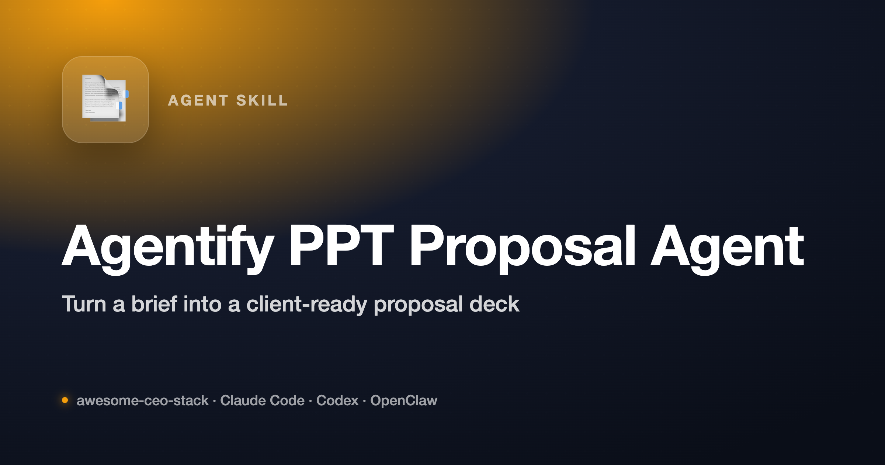

<p align="center"></p>

<div align="center">

# Agentify PPT Proposal-Writing Agent

### Proposal AI Agent · 提案型 AI 智能体 · 提案作成 AI エージェント · 제안형 AI 에이전트 · Agente de IA para Propuestas


[**🌐 Multilingual**](#-多语言介绍--multilingual--多言語--다국어--multilingüe) ·
[**是什么**](#是什么) ·
[**🧠 能力地图**](#-能力地图) ·
[**🚀 60 秒开始**](#-60-秒开始) ·
[**📁 仓库结构**](#-仓库结构) ·
[**❓ FAQ**](#-faq)

</div>

---

## 🌐 多语言介绍 / Multilingual / 多言語 / 다국어 / Multilingüe

### 🇨🇳 中文

**Agentify PPT Proposal Agent** 是一个面向 **培训咨询 / 人才发展 / 领导力项目 / 客户提案** 的 **提案型 AI 智能体**。它不是通用聊天机器人，而是一个围绕客户需求澄清、知识库检索、方案结构设计、提案写作、HTML 转 PPT 交付来工作的咨询型 agent。它特别适合把模糊的客户需求，快速整理成结构清楚、语言专业、可直接交付的咨询提案。

### 🇬🇧 English

**Agentify PPT Proposal Agent** is a **proposal-focused AI agent for training, leadership, consulting, and talent-development work**. It is not a general chatbot. It is designed to turn ambiguous client requests into structured proposals by combining local knowledge assets, reusable consulting patterns, proposal frameworks, and an HTML-to-PPT delivery workflow.

### 🇯🇵 日本語

**Agentify PPT Proposal Agent** は、**研修・リーダーシップ・コンサルティング・タレント開発** 向けの **提案特化型 AI エージェント**です。一般的なチャットボットではなく、曖昧な顧客要望を、ローカル知識ベース・再利用可能な提案パターン・HTML から PPT への変換ワークフローを用いて、構造化された提案書へ落とし込むために設計されています。

### 🇰🇷 한국어

**Agentify PPT Proposal Agent** 는 **교육, 리더십, 컨설팅, 인재 개발** 업무를 위한 **제안 특화형 AI 에이전트**입니다. 일반 챗봇이 아니라, 모호한 고객 요청을 로컬 지식 자산, 재사용 가능한 컨설팅 구조, 제안 프레임워크, HTML-to-PPT 전달 워크플로우를 통해 구조화된 제안서로 바꾸도록 설계되었습니다.

### 🇪🇸 Español

**Agentify PPT Proposal Agent** es un **agente de IA enfocado en propuestas para formacion, liderazgo, consultoria y desarrollo de talento**. No es un chatbot general. Su funcion es convertir solicitudes ambiguas de clientes en propuestas estructuradas combinando conocimiento local, patrones reutilizables de consultoria, marcos de propuesta y un flujo de trabajo de HTML a PPT.

---

## 是什么

**Agentify PPT Proposal Agent** 是一个为咨询型提案场景打造的 agent 仓库。

它主要解决这些问题:

1. **客户需求很模糊**: 只说“想做管理培训”或“要一个高潜项目”,但没有清晰结构。
2. **提案总从零开始**: 每次都重新翻资料、重组语言、重画 deck。
3. **知识资产散落**: 公司介绍、方法论、案例、课程模块分布在不同目录里。
4. **交付链路断裂**: 提案文案、页面结构、PPT 生成分散在不同流程里。
5. **咨询语气难保持稳定**: 通用 AI 容易写成泛泛而谈的营销文案，而不是专业提案。

这个 agent 的核心职责不是闲聊，而是:

- 理解客户真实需求
- 匹配合适的培训 / 咨询方案类型
- 优先复用本地知识库和历史资产
- 输出结构化提案草稿
- 把 HTML 演示稿转换成 `.pptx` 交付件

> **一句话总结**: 一个把模糊客户需求转成专业咨询提案和 PPT 交付件的提案型 AI agent。

---

## 🧠 能力地图

当前这个 agent 的核心能力包括:

| 能力 | 作用 | 适合场景 |
|---|---|---|
| **需求澄清** | 把模糊客户需求变成明确提案类型 | 培训、工作坊、人才项目、领导力咨询 |
| **知识库优先检索** | 优先复用本地 `knowledge-base/` 和历史资料 | 降低重复写作、提高一致性 |
| **提案结构设计** | 把请求映射到 proposal deck 结构 | 客户方案、项目建议书、课程设计 |
| **咨询风格写作** | 用更专业、更可信的 consulting tone 输出文案 | 对外客户提案 |
| **HTML-to-PPT 交付** | 从 HTML slide 草稿到 `.pptx` 文件 | 本地交付物生成 |
| **客户记忆与上下文延续** | 记录客户名称、行业、需求、常用模块等信息 | 后续跟进、迭代提案 |

更细的能力说明见 [SMART_CAPABILITIES.md](./SMART_CAPABILITIES.md)。

---

## 🚀 60 秒开始

### 前置理解

这个仓库更适合:

- 有明确客户背景和项目需求
- 已经沉淀了一部分知识库 / 方案资产
- 需要快速产出专业提案或 deck

### 典型工作流

1. 读取客户请求
2. 搜索本地知识库和参考提案
3. 判断这是课程、bootcamp、高潜项目、行动学习还是咨询项目
4. 搭建 proposal 结构
5. 生成 HTML slide 内容
6. 转换成 `.pptx`
7. 把关键客户信息写入记忆，便于后续跟进

### 快速浏览入口

如果你刚进入这个仓库，建议先看:

- [`SMART_CAPABILITIES.md`](./SMART_CAPABILITIES.md)
- [`AGENTS.md`](./AGENTS.md)
- [`SOUL.md`](./SOUL.md)
- [`knowledge-base/`](./knowledge-base)

---

## 📁 仓库结构

```text
agentify-ppt-proposal-agent/
├── README.md
├── AGENTS.md
├── SOUL.md
├── IDENTITY.md
├── USER.md
├── TOOLS.md
├── MEMORY.md
├── HEARTBEAT.md
├── SMART_CAPABILITIES.md
├── knowledge-base/
├── scripts/
├── html_to_pptx.py
├── build_ppt_from_html.sh
├── reset_feishu_smart_session.sh
└── STALE_LOCK_RUNBOOK.md
```

可以按 4 层理解:

1. **Agent instruction layer**
   - `AGENTS.md`
   - `SOUL.md`
   - `IDENTITY.md`
   - `USER.md`
   - `TOOLS.md`
   - `MEMORY.md`
   - `HEARTBEAT.md`

2. **Knowledge and reusable assets**
   - `knowledge-base/`
   - `scripts/`

3. **PPT generation workflow**
   - `html_to_pptx.py`
   - `build_ppt_from_html.sh`

4. **Operational helpers**
   - `reset_feishu_smart_session.sh`
   - `STALE_LOCK_RUNBOOK.md`

---

## 这个 agent 和通用 AI 的区别

| 维度 | 通用 AI | **Agentify PPT Proposal Agent** |
|---|---|---|
| 目标 | 通用问答 | **客户提案与咨询交付** |
| 知识来源 | 主要靠模型记忆 | **优先本地知识库和内部资产** |
| 输出风格 | 泛化 | **咨询提案结构化输出** |
| 交付物 | 文本回答 | **proposal draft + HTML deck + PPT** |
| 上下文延续 | 弱 | **记录客户与项目记忆** |

---

## 输出哲学

这个 agent 默认偏好:

- **结构化思考** 高于泛泛表述
- **明确假设** 高于凭空补全
- **项目设计** 高于课程堆叠
- **复用知识资产** 高于一次性 improvisation
- **客户可交付** 高于“看起来聪明”的聊天输出

---

## ❓ FAQ

**它是一个通用 chatbot 吗?**
不是。它是一个面向咨询和培训提案的专用 agent。

**为什么强调本地知识库优先?**
因为提案质量很大程度取决于历史资产、案例、方法论，而不是模型临场发挥。

**它最适合什么场景?**
客户提案、项目建议书、培训方案、领导力项目、bootcamp 和 workshop 设计。

**它一定要输出 PPT 吗?**
不一定，但它已经内置了从 HTML 到 `.pptx` 的交付链路，所以很适合走完整交付流程。

**这个仓库适合放进 Awesome CEO Stack 吗?**
适合。它代表的是 CEO / 咨询负责人常用的“提案与客户沟通能力模块”。

---

## 适合放进 Awesome CEO Stack 的原因

如果把 `awesome-ceo-stack` 看成一个 CEO operating system，这个 agent 补的是很关键的一块:

- 对客户的提案表达能力
- 把模糊需求翻译成结构化方案的能力
- 用知识库驱动交付而不是空想的能力
- 从“想法”走到“可展示 deck”的能力

所以它不只是一个咨询 agent，也是一种很典型的 **CEO 级对外表达与解决方案设计 skill**。
