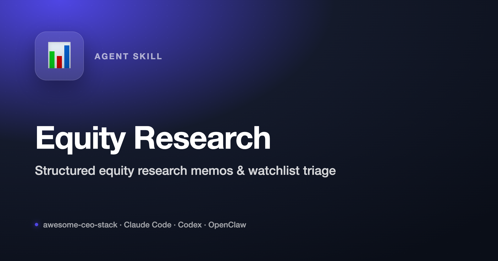

<p align="center"></p>

# OpenClaw Equity Research [](https://github.com/X-RayLuan/openclaw-equity-research/stargazers) [](https://github.com/X-RayLuan/openclaw-equity-research) [](https://github.com/X-RayLuan/openclaw-equity-research)

> Analyst-grade public-equity research workflows for OpenClaw: earnings previews, post-earnings notes, model update summaries, initiating coverage drafts, sector overviews, catalyst calendars, thesis trackers, idea screens, and ticker memos.

[Feature Matrix](#feature-matrix) · [Research Workflow](#research-workflow) · [Quick Start](#quick-start) · [Example Output](#example-output) · [Files](#files) · [Disclaimer](#disclaimer)

---

## Product Preview

OpenClaw Equity Research is a skillpack that gives OpenClaw a structured analyst workflow instead of a generic stock prompt.

It helps the agent:

- choose the right research workflow for the request
- gather fresh primary sources when facts are current or market-sensitive
- separate facts, calculations, assumptions, inference, and judgment
- produce notes with evidence tables, risks, counterarguments, and review gates
- route spreadsheet, document, presentation, and web-research work to the right tools

The skill is built for research assistance and analyst workflow automation. It is not financial, legal, tax, accounting, or trading advice.

---

## Feature Matrix

| Capability | Coverage |
| --- | --- |
| Earnings preview | Consensus setup, prior guidance, buyside debate, key KPIs, likely stock-moving questions, bull/base/bear print scenarios |
| Post-earnings analysis | Release, presentation, transcript, filing, actuals versus expectations, guide changes, margin drivers, segment trends, management tone |
| Model update notes | Actuals import, forecast driver changes, valuation and sensitivity updates, changed-assumption log |
| Initiating coverage | Investment summary, business model, industry map, competitive position, financial drivers, valuation, risks, catalysts |
| Sector overview | Value chain, demand/supply drivers, regulation, technology, pricing, peer comparison, valuation dispersion |
| Catalyst calendar | Dated events, expected impact, source, confidence, prep notes |
| Thesis tracker | Thesis, evidence, counterevidence, catalyst, confidence, kill criteria, next action |
| Idea generation | Dislocations, estimate revisions, quality versus valuation, margin inflection, refinancing risk, short interest, ownership changes |

### Source and Tooling Coverage

| Type | Preferred Sources or Tools |
| --- | --- |
| Primary company evidence | SEC/company filings, investor relations releases, earnings presentations, transcripts, official company websites |
| Market and calendar facts | Fresh web/data-provider checks, exchange or regulator sources, user-provided vendor exports |
| Research context | Reputable financial press, analyst summaries, user notes, company presentations |
| Spreadsheet work | Forecast tables, comps, sensitivities, model update logs, `.xlsx` files |
| Document output | Professional notes, redlines, `.docx` artifacts |
| Presentation output | Company overview decks, sector decks, investment committee materials |

---

## Quick Start

### Option 1: Use in OpenClaw Webchat

Install or sync the skill into OpenClaw's active workspace skills path:

```text
/Users/m1/.openclaw/workspace/skills/openclaw-equity-research/
```

Then ask:

```text
Use OpenClaw Equity Research to write an earnings preview for NVDA.
```

```text
Prepare a post-earnings update for TSLA with reported KPIs, guidance changes, model implications, and risks.
```

```text
Build a catalyst calendar for AMD and NVDA for the next two quarters.
```

```text
Draft an initiating coverage outline for RKLB with valuation framework and thesis kill criteria.
```

```text
Compare PLTR and SNOW as an idea-generation screen with evidence, counterarguments, and next diligence.
```

### Option 2: Use the Lightweight Script

From this skill directory:

```bash
python3 scripts/equity_research.py AAPL --out reports
python3 scripts/equity_research.py TSLA NVDA RKLB --mode watchlist --out reports
python3 scripts/equity_research.py --template AAPL --out reports
```

The script writes:

- `{ticker}-equity-research.md`
- `{ticker}-equity-research.json`
- `watchlist-equity-research.md`

The script is intentionally lightweight. It is a fast starting point; the skill instructions tell OpenClaw to add fresh sourcing, assumptions, judgment, and human-review gates when the user needs a research-quality output.

---

## Research Workflow

### 1. Classify the deliverable

OpenClaw first identifies whether the task is an earnings note, preview, model update, initiation, sector overview, catalyst calendar, thesis tracker, idea screen, or one-off memo.

### 2. Gather current evidence

For current company facts, market prices, estimates, filings, executives, calendar events, and news, OpenClaw should browse or use connected data sources. It should prefer primary sources and disclose stale or missing data.

### 3. Build the research artifact

The default research artifact includes:

- **Snapshot**: company, ticker, date, source freshness, currency, market data timestamp
- **Key takeaways**: what changed, why it matters, what to watch
- **Evidence table**: metric/event, source, reported value, comparison point, implication
- **Model and valuation assumptions**: drivers, ranges, sensitivities, conclusion-changing inputs
- **Risks and counterarguments**: strongest opposing case and missing diligence
- **Source list**: links or local files for material claims
- **Human review note**: checks needed before external use

### 4. Review before external use

The skill explicitly blocks unsupported recommendation language, invented market data, hidden valuation assumptions, mixed currencies or fiscal periods, and external publishing without user approval.

---

## Example Output

```markdown
# NVDA Earnings Preview

## Snapshot
- Company / ticker:
- Event date:
- Source freshness:
- Currency:
- Market data timestamp:

## Key Takeaways
- ...

## Evidence Table
| Metric / event | Source | Reported value | Comparison point | Implication |
| --- | --- | --- | --- | --- |

## Debate Into The Print
- Bull case:
- Base case:
- Bear case:

## Model And Valuation Assumptions
- Revenue driver:
- Margin driver:
- Capex / cash flow:
- Sensitivity:

## Risks And Counterarguments
- ...

## What To Watch Next
- ...

## Human Review Notes
- Verify source timestamps and consensus inputs before external distribution.
```

---

## Configuration Notes

This skill does not require a fixed data vendor. Quality depends on the sources available in the active OpenClaw session.

Recommended setup:

| Need | Recommended Setup |
| --- | --- |
| Fresh filings and releases | Web access or SEC/company IR links |
| Earnings transcripts | User-provided transcript, official IR transcript, or trusted transcript source |
| Consensus and estimates | User-provided model/vendor export when available |
| Market data | Connected data provider or fresh web check with timestamp |
| Model update work | Spreadsheet-capable environment and source model |
| Final memo or deck | Document or presentation tool access |

---

## Files

| File | Purpose |
| --- | --- |
| `SKILL.md` | Agent-facing routing, output contract, tool guidance, and guardrails |
| `references/workflows.md` | Detailed workflow checklists |
| `references/research-standard.md` | Source, evidence, calculation, writing, and review standards |
| `references/research-framework.md` | Original memo framework |
| `references/data-sources.md` | Data-provider guidance and caveats |
| `references/report-rubric.md` | Quality rubric for review-ready output |
| `scripts/equity_research.py` | Lightweight ticker memo generator |
| `agents/openai.yaml` | OpenAI/OpenClaw UI metadata |

---

## Related Workflows

This skill pairs well with:

| Workflow | How it helps |
| --- | --- |
| OpenClaw webchat | Interactive research, follow-up questions, and artifact drafting |
| Spreadsheet workflows | Forecast updates, comps, valuation tables, sensitivities |
| Document workflows | Professional research notes and redlined drafts |
| Presentation workflows | Company overview, sector overview, or IC-style decks |

---

## Disclaimer

This project is for research assistance and workflow automation only. It does not provide investment advice, trading instructions, legal advice, tax advice, accounting advice, compliance approval, or audited financial models. Users are responsible for verifying all data, assumptions, citations, and conclusions before making decisions or sharing outputs externally.
